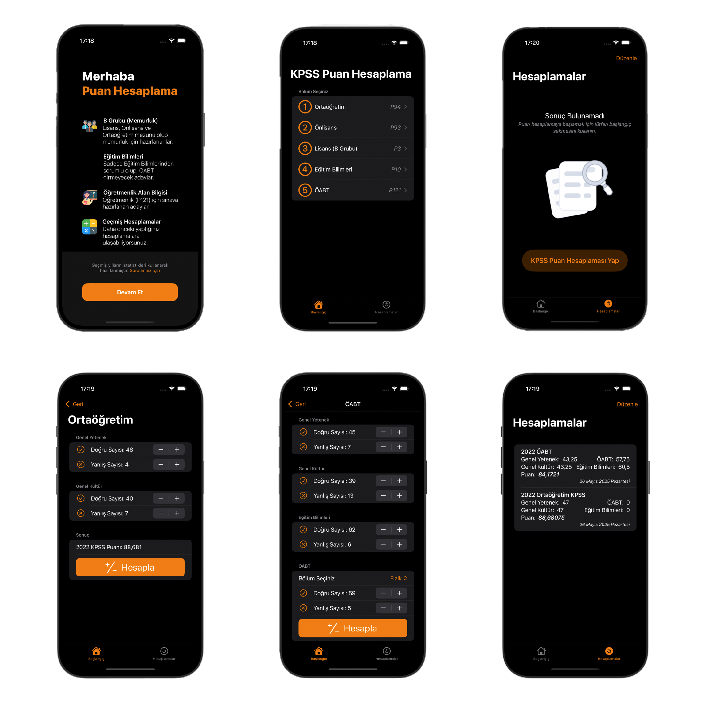

## 📷 Ekran Görüntüleri

# KPSS Puan Hesaplama

📱 **KPSS Puan Hesaplama**, Türkiye'deki Kamu Personeli Seçme Sınavı (KPSS) için kullanıcıların doğru, yanlış ve net sayılarına göre tahmini puanlarını kolayca hesaplamalarını sağlayan sade ve işlevsel bir iOS uygulamasıdır.

## 🧠 Özellikler

- 📊 **Genel Yetenek & Genel Kültür**, **Eğitim Bilimleri**, **ÖABT**, **Alan Bilgisi** testleri için hesaplama desteği
- 🌙 **Dark/Light Mode** desteği
- 🎨 Kullanıcı dostu SwiftUI arayüzü
- 🔐 Tüm veriler lokal olarak saklanır
- 📈 Gelişmiş sonuç ekranı
- 📲 **SwiftData** ile veri yönetimi
- 📢 **Google AdMob** reklam entegrasyonu
- 🔔 **Firebase Push Notification** desteği

## 🛠 Kullanılan Teknolojiler

- **SwiftUI**
- **MVVM Architecture**
- **SwiftData**
- **Google Mobile Ads SDK**
- **Firebase**
- **Observation Macro**

